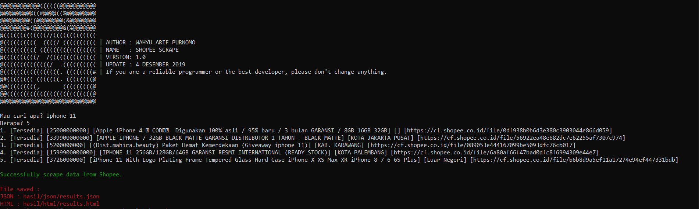
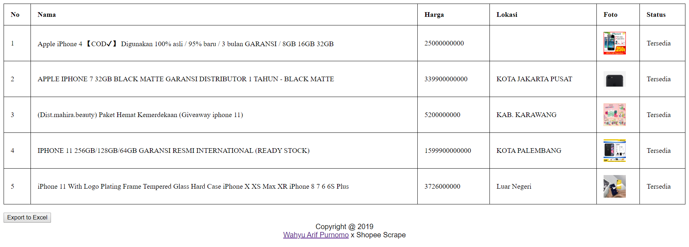
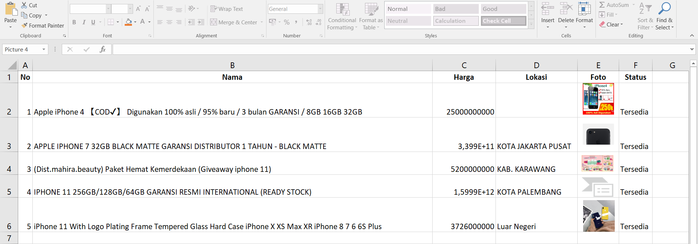

<H1 align="center">
SHOPEE SCRAPE
</H1>
<H4 align="center">
Shopee Scrape is a tool that functions to collect data - the data needed, such as finding data from photos, prices, names, store locations and others. 
</H4>

 

Made with ❤️ by <a href="https://github.com/warifp">Wahyu Arif Purnomo</a>

<a>  Terminal Shopee Scrape  </a>
  

<a>  HTML Shopee Scrape  </a>
  

<a>  Export to Excel  </a>
  

## Features in tools

| Name                               | Status             | Information                                        |
| ---------------------------------- | ------------------ | -------------------------------------------------- |
| Nama Barang                        | :white_check_mark: | nama lengkap barang [judul]                        |
| Harga Barang                       | :white_check_mark: | harga barang terkini [price]                       |
| Status Stock                       | :white_check_mark: | status stock tersedia atau tidak tersedia          |
| Foto Barang                        | :white_check_mark: | foto barang artikel                                |
| Lokasi Toko                        | :white_check_mark: | lokasi toko berdasarkan informasi toko             |

You can use your search results with the "results.json" API file stored in "results / json / results.json".

## Version

Version 1.0 :

  Changelog :

-   Add tools

## Installation

### Windows or Linux
You can download the latest composer in [here](https://getcomposer.org/download/).

    git clone https://github.com/warifp/Shopee-Scrape

    composer update
    
### Termux

    pkg install php

    pkg update

    git clone https://github.com/warifp/Shopee-Scrape

## Requirements for using this tool

We need several requirements to use this tool to run smoothly.

##### Linux

##### Windows

## Usage

Enough to execute the command :

    php run.php

and don't forget to ask at [issue page](https://github.com/warifp/Shopee-Scrape/issues)
If you have additional information, you can make it on the [issue page](https://github.com/warifp/Shopee-Scrape/issues).

## Thanks

Thank you for all.

1.  ASCII Art Generator : [TAAG](http://patorjk.com/software/taag).

## Donation

    If you want to buy my coffee, you can send payments Paypal.

## Disclaimer

This is an open source for everyone, you may redistribute, modify, use patents and use privately without any obligation to redistribute. but it should be noted to include the source code of the library that was modified (not the source code of the entire program), include the license, include the original copyright of the author (warifp), and include any changes made (if modified). Users do not have the right to sue the creator when there is damage to the software or even demand if there is a problem caused by the makers of this tool. because every risk is caused by the user risk itself.
